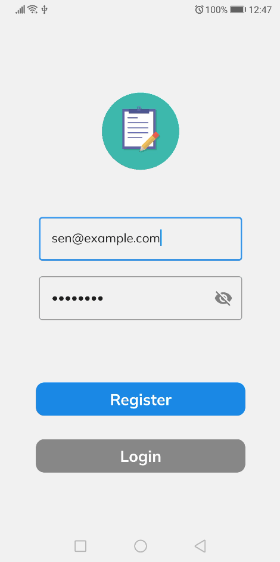
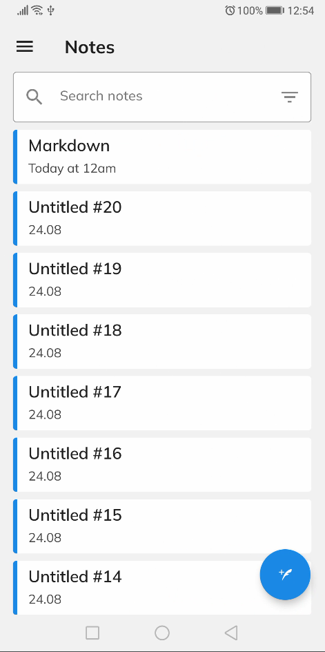
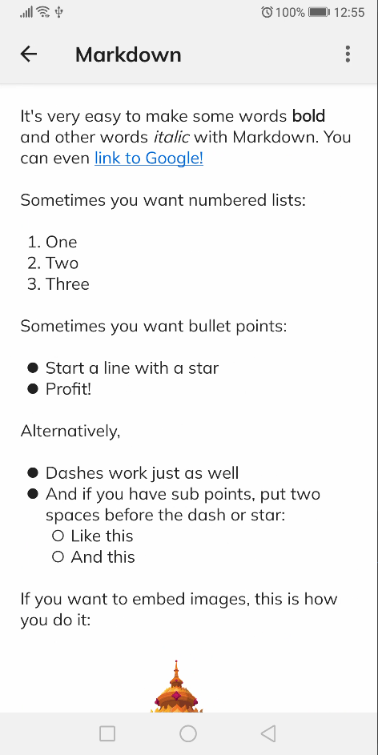
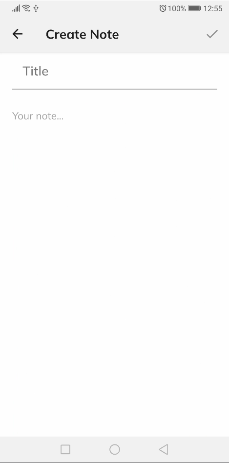

# Notable - App

The Android app using [Jetpack Compose](https://developer.android.com/jetpack/compose) and a
Multi-Module structure.

## Screenshots

<table>
  <tr>
    <tr>
    <td></td>
    <td></td>
    <td></td>
    <td></td>
    </tr>
</table>

## Stack

- [Jetpack Compose](https://developer.android.com/jetpack/compose) to create the views
- [Ktor](https://ktor.io/) for HTTP Requests
- [SQLDelight](https://cashapp.github.io/sqldelight/) as the cache
- [Hilt](https://developer.android.com/training/dependency-injection/hilt-android) for dependency
  injection
- Multi-Module approach
- Unit Tests

The usage of Ktor (instead of Retrofit) and SQLDelight (instead of Android Room) allows for later
refactoring into a [KMM](https://kotlinlang.org/lp/mobile/) project.

## Module Design

| Module name                                         | Type                | Description                                                                                                    |
| --------------------------------------------------- | ------------------- | -------------------------------------------------------------------------------------------------------------- |
| [app](/app/)                                        | Android Application | MainActivity, BaseApplication, Theme, Hilt setup.                                                              |
| [core](/core/)                                      | Java/Kotlin Library | Core business models and classes.                                                                              |
| [note-datasource](/note/note-datasource/)           | Java/Kotlin Library | Data-sources (network and cache) for the note Module.                                                          |
| [note-datasource-test](/note/note-datasource-test/) | Java/Kotlin Library | Data-source test fakes. These are contained in their own module so they can be used in tests in other modules. |
| [note-domain ](/note/note-domain/)                  | Java/Kotlin Library | Domain models and classes for the note Module.                                                                 |
| [note-interactors ](/note/note-interactors/)        | Java/Kotlin Library | Use-cases for the note Module.                                                                                 |
| [ui-noteList](/ui-noteList/)                        | Android Library     | UI components for the NoteList screen.                                                                         |
| [ui-noteDetail](/ui-noteDetail/)                    | Android Library     | UI components for the NoteDetail screen.                                                                       |
| [ui-noteForm](/ui-noteForm/)                        | Android Library     | UI components for the NoteForm screen.                                                                       |
| [constants](/constants/)                            | Java/Kotlin Library | Random constants.                                                                                              |
| [shared](/components/)                              | Android Library     | Shared android components, SessionManager, RefreshManager, ConnectivityManager                                 |

The [auth](/auth/) module is equivalent to the note one.

## Credits

- [CodingWithMitch](https://github.com/mitchtabian/Dota-Info): This project is based on his
  Multi-Module tutorial.
- [Jeziel Lago](https://github.com/jeziellago/compose-markdown): The markdown components are taken
  and adapted from his repository.
