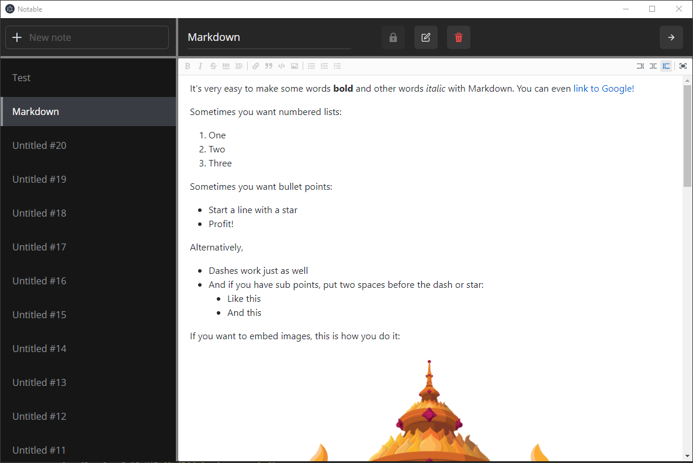

# Notable - Client

The desktop client written in Typescript using React and [Electron](https://www.electronjs.org/).

# Screenshot

# Stack

- [Electron Forge](https://www.electronforge.io/) to bundle the application.
- [Zustand](https://github.com/pmndrs/zustand) to handle state management.
- PostgreSQL
- [Chakra UI](https://chakra-ui.com/) for styling.
- [Markdown Editor](https://github.com/uiwjs/react-md-editor) to handle the markdown.

# Installation

1. Install the latest version of [NodeJS](https://nodejs.org/en/).
2. Run `npm install` to install all the dependencies.
3. Run `npm start` to start the application.
4. (Optional) Run `npm make` to create the production build.

# Known Issues

- Black screen on first login or stuck on data sync
  - Restart the application or hit `Ctrl + Shift + R` to reload.
- Notes from the previous account are displayed if the user logs out and logs in with another account.
  - Restart the application
